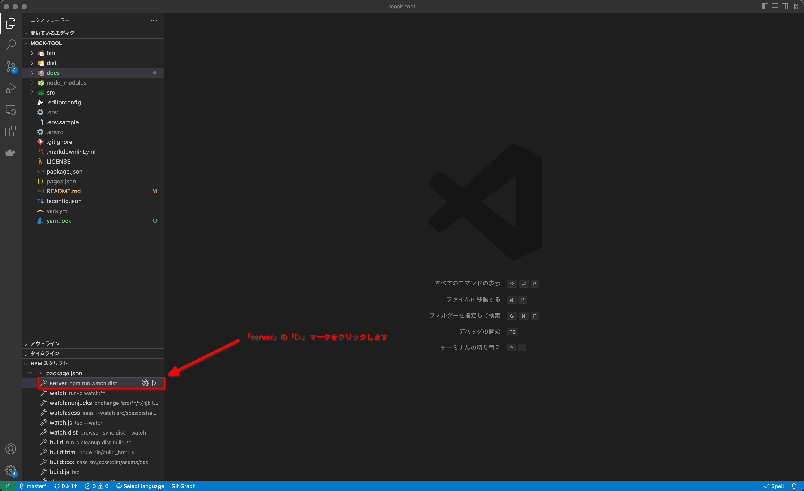

Mock tool
==================

モックアップの作成ツールです。

ディレクトリ構造
-----------------

```
{mook_tool_root}/
├ LICENSE
├ README.md
├ src/ => モックアップのもととなるテンプレートを配置するディレクトリです。
├ dist/ => 生成されたモックアップがこのディレクトリに出力されます。
├ docs/ => ドキュメント用ディレクトリです。
├ bin/ => 各種スクリプト格納ディレクトリです。
├ package.json
├ tsconfig.json
└ [vars.yml] => テンプレートの変数定義ファイルです。(必要に応じて作成してください)
```

セットアップ方法
-----------------

### 依存パッケージをインストールします

以下のいずれかのコマンドを実行し、依存パッケージをインストールします。

```
npm install 
```

または

```
yarn install
```

使い方
-----------------

VSCodeを起動後、画面左下の「npmスクリプト」より「server」をクリックし、
簡易Webサーバーを起動します。



「src」ディレクトリにモックアップのテンプレートを作成していきます。

テンプレートファイルの変更があった場合、ブラウザの自動リロードが行われ
変更内容が画面に反映されます。

### 監視対象ファイルの拡張子

「src」ディレクトリ内の以下のファイルの更新を監視し、
変更があった場合に自動的に再ビルドを行い、ブラウザをリロードます。

* `*.njk`
* `*.twig`
* `*.html`
* `*.ts`
* `*.js`
* `*.scss`
* `*.sass`
* `vars.yml`

テンプレートについて
-----------------

テンプレートエンジンを利用することで、
複数の画面で利用する共通のパーツを別ファイルとして切り出し、
切り出したパーツファイルを呼び出すことで複数の画面で再利用できます。

モックアップのテンプレートエンジンに[Nunjucks][]を利用しています。

テンプレートの記法については、以下の公式サイトを参照してください。

[Nunjucks][]

[Nunjucks]: https://mozilla.github.io/nunjucks/

### パーツファイルについて

`_`で始まるファイル、または、ディレクトリ内のファイルはパーツとして扱われ、
単体のモックアップとしては生成されません。

#### ファイル名の例

パーツとして認識されるファイルの例は以下のとおりです。

* `_header.njk`
* `_menu.njk`
* `_footer.njk`
* `_partial/header.njk`
* `_partial/menu.njk`
* `_partial/footer.njk`
* `_layout/default.njk`
